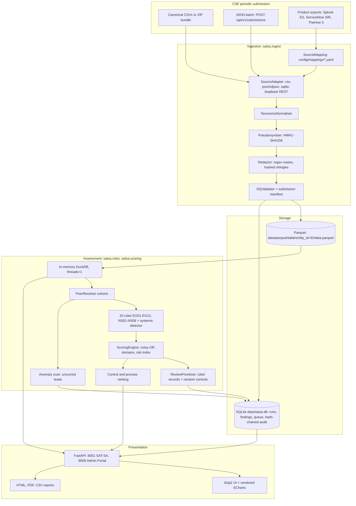
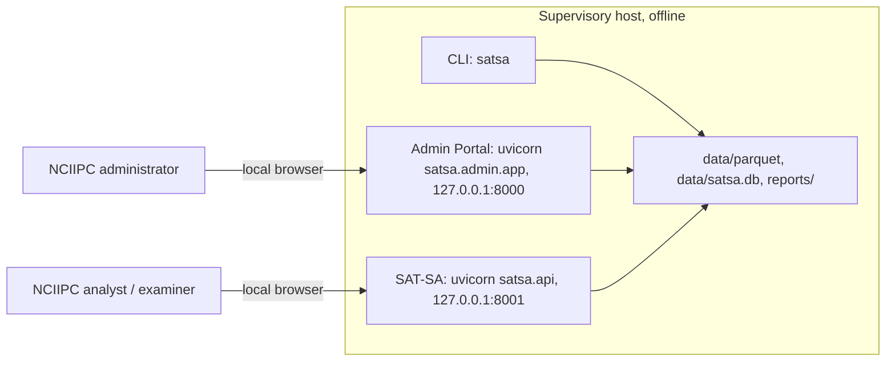

# SAT-SA Architecture & System Design

> **Supervisory Notice:** *Indicators requiring supervisory review; not a compliance determination.*

The **Supervisory Analytics Tool for SOC Assessment (SAT-SA)** is an offline, deterministic analytical tool built for the **National Critical Information Infrastructure Protection Centre (NCIIPC)** use case in PS SIH26157. It assesses how Critical Sector Entities (CSEs) ran their Security Operations Centres (SOCs) over a review period, using the periodic batch submissions the CSEs provide. It uses no machine learning.

Every statement below was checked against the code in the quality pass of October 2026; the mismatches found and how each was resolved are listed in `docs/CHANGES_quality_pass.md`.

---

## 1. Core Principles

1. **No AI/ML.** Findings come from SQL queries over DuckDB tables and deterministic rule predicates with configurable thresholds, some compared against a peer cohort. NS03 and EG11 flag robust z-score (median/MAD) outliers against the peer cohort; IQR and CUSUM/EWMA exist in `satsa/peers/` but no rule uses them (DECISIONS.md ADR-001).
2. **Offline operation and data minimisation.**
   - Both portals bind to `127.0.0.1` unless `SATSA_HOST` (or `--host`) says otherwise (`satsa/serving.py`). Inside the container they listen on `0.0.0.0` so Docker can publish the ports; `docker-compose.yml` publishes them on the host's `127.0.0.1` unless `SATSA_BIND_ADDRESS` is set. `Containerfile` (the single-portal image) hard-codes `--host 0.0.0.0` for the same reason; publish it with `-p 127.0.0.1:8000:8000`.
   - SAT-SA makes no outbound network calls. As **best-effort defence in depth**, `satsa/netguard.py` installs an in-process egress guard when either portal starts (FastAPI lifespan, so `satsa serve`, `satsa admin`, `entrypoint.py` and a bare `uvicorn satsa.api:app` are all covered): Python socket connections to anything other than loopback raise `EgressBlockedError`. It is **not** a sandbox: native code that bypasses Python's `socket` module is not covered, and DNS lookups are not blocked. `SATSA_ALLOW_EGRESS=1` turns it off (logged). The host firewall and the physical air gap remain the real controls. Separately, `SourceAdapter.read_api` refuses any non-loopback URL before opening a socket.
   - Analyst handles, closers and case owners are pseudonymised with HMAC-SHA256 under a local 32-byte salt (`.satsa_salt`, `ingest/pseudonymise.py`). Free text is regex-redacted (e-mail, IPv4, full-form IPv6, host names, digit runs of 8 or more; `ingest/redact.py`), closure comments are kept only as a normalised hash and hashed 3-word shingles, and unknown source columns are dropped.
3. **Tamper-evident audit trail.** Ingests, assessment runs, configuration changes and examiner actions are appended to `audit_log` (and administrative actions to `admin_audit_log`) in SQLite, each entry hash-chained to the previous one (SHA3-256 for new entries, legacy SHA-256 entries still verify). The chain detects an edited, inserted, deleted or reordered entry anywhere except the end. Removal of the newest entries, or a full recomputation of the chain by someone with write access, is only detectable against a checkpoint kept off-box: `satsa audit checkpoint --sign` writes one signed with Ed25519 and `satsa audit verify --checkpoint --pubkey` checks it (DECISIONS.md ADR-004, ADR-005, ADR-008). The trail is tamper-evident, not tamper-proof.

---

## 2. Component Architecture

---

## 3. Data Flow and Storage

1. **Ingestion and privacy** (`satsa/ingest/`):
   - `SourceAdapter` reads CSV (via Polars), JSON or NDJSON, a table from an SQLite export, or a **loopback-only** REST endpoint. `satsa ingest` reads every table of an SQLite database export (`.db`, `.sqlite`, `.sqlite3`) as if it were a file named after the table, and `satsa ingest --api-config` stages loopback REST endpoints as files and ingests them through the same checks. There are no product-specific adapter classes: product exports (Splunk ES, ServiceNow SIR, TheHive 5) are translated by a YAML `SourceMapping` (`ingest/mapper.py`, `config/mappings/cse_splunk.yaml`, `cse_servicenow.yaml`, `cse_thehive.yaml`), selected with `satsa ingest --source splunk|servicenow|thehive --entity <id>`. What each export can and cannot supply is in `docs/connectors.md`.
   - `TaxonomyNormaliser` maps severity and disposition labels into the canonical vocabulary of `satsa/models/canonical.py` (15 tables: `entity`, `asset`, `log_source_daily`, `detection_rule`, `alert`, `case`, `case_alert_link`, `workflow_event`, `escalation`, `closure`, `remediation`, `external_report`, `declared_kpi`, `sla_policy`, `submission_batch`).
   - A canonical CSV table is normalised column by column (`ingest/columnar.py`): column aliases, the entity-ID checks, pseudonymisation, taxonomy mapping and comment redaction are Polars expressions, and the per-value functions (HMAC, taxonomy lookup, redaction) run once per distinct value. Anything that path cannot reproduce exactly (a column of mixed types, two alias columns for one field, JSON, product exports through a mapping) is normalised row by row in chunks of 100,000 (`CHUNK_ROWS`), as before. `tests/test_columnar_ingest.py` checks that both give identical stored tables, ingest results and DQ issues. Pseudonymisation and redaction are described in Section 1.
   - The data-quality checks (`ingest/dq_checks.py`; `FrameDQ` during ingest, with the same results as `DQValidator`) record required-field gaps, duplicate IDs, alert-ID sequence gaps, null rates and orphaned references in `dq_issues`. The close-before-create check reads text timestamps (CSV and JSON submissions) the way the store loads them (`text_timestamp_sql` in `store/duckdb.py`: a UTC offset is applied, text without one is taken as UTC), so it reports exactly the alerts the rules see as closed before they were created. A submission manifest records which tables each entity sent, so a rule whose table was never submitted is reported as not assessed.

2. **Parquet store** (`satsa/store/duckdb.py`):
   - **All 15 canonical tables** are written as Parquet, one file per table and entity: `data/parquet/{table}/entity_id={entity_id}/data.parquet` (hive-style). There is no time partitioning. A later ingest for the same entity is merged into that file (de-duplicated; the `entity` table keeps one row per entity, newest non-null value per column).
   - For an assessment, `DuckDBStore.load_all_tables()` reads **every** table into an in-memory DuckDB database. There is no partition pruning at query time: the rules query in-memory tables. The web app keeps one loaded store in `AnalyticsCache` and reloads it only when a new run completes or the Parquet store changes.
   - DuckDB is pinned to **one thread** (`PRAGMA threads=1`): parallel floating-point aggregation can differ in the last bits between runs and flip a threshold comparison, which would break the reproducibility guarantee. More cores therefore do not shorten an assessment. Measured timings are in `docs/benchmarks.md`.

3. **State store** (`satsa/store/sqlite.py`, `data/satsa.db`, WAL mode):
   - Runs, findings and evidence, domain and entity scores, review queues, examiner dispositions, blind-review verdicts, identities and sessions, the admin activity feed (`live_events`, not chained; ADR-006) and the two hash-chained audit logs.

---

## 4. Analytical Method

- **Execution Gaps (EG01–EG12):** fast closures, closures without investigation, missing escalations, template closures, repeat alerts without root cause, metric gaming and SLA hugging, implausible analyst throughput, unacknowledged escalations, stale cases, KPI reconciliation gaps, disposition extremes, skipped containment.
- **Negative Space (NS01–NS08):** silent critical assets, missing alert categories, low night-time activity, high/critical true positives with no case, dormant detection rules, ghost inventory, missing external reports, missing months.
- **Systemic detector** (`rules/systemic.py`): the same rule firing on 3 or more entities that share a third-party SOC provider in one run.
- **Scoring** (`scoring/scorer.py`):
  - Rule score: strength beyond the threshold × rule weight × sample-size confidence, $\text{Score} = \text{strength} \times \text{weight} \times \min(1, n / n_{\min})$.
  - Domain score: noisy-OR over the rule scores in each of 8 capability domains, $S_d = 100 \times \left(1 - \prod (1 - s_i/100)\right)$.
  - Entity risk index: $(1 - w_b) \times$ the weighted mean of the 8 domain scores $+\ w_b \times$ a breadth score (10 points per distinct rule triggered, capped at 100), with $w_b$ = `breadth_weight` in `config/scoring.yaml` (default 0.10).
  - Review queue (`scoring/prioritiser.py`): per entity, records cited by findings (highest accumulated score first, up to 70% of the queue size) plus a severity-stratified random control sample.
  - Controls and processes (`scoring/control_priorities.py`): rules ranked by how many entities failed them, then severity; the eight domains ranked by how many entities score 50 or more.
- **Exploratory anomaly scan** (`peers/anomaly_scan.py`, `config/anomaly.yaml`): about 40 operational rates per entity, flagged as peer outliers (robust z of 3.5 or more against the cohort) or time shifts (CUSUM against the entity's first three months). Leads are stored per run and shown, but **not scored**: no severity, no effect on the risk index or review queue (DECISIONS.md ADR-007).

Full rule logic: `docs/analytics_methodology.md`.

---

## 5. Deployment and Security Topology

- **Ports:** the Admin Portal serves on `:8000` and SAT-SA on `:8001` (`entrypoint.py` starts both; `satsa admin` and `satsa serve` start one each). Optional TLS via `SATSA_TLS_CERT` + `SATSA_TLS_KEY` (`docs/deployment_ops.md` Section 1.3).
- **No CDN:** all front-end assets (Apache ECharts, CSS) are vendored in `satsa/ui/static` and `satsa/admin/static`; `tests/test_offline_hardening.py` scans every template and static file and requests every GET route under a socket guard.
- **Roles:** SAT-SA admits two roles, `analyst` (ingest, runs, tuning, raw alerts, audit ledger) and `examiner` (review decisions, blind review, dossiers). Administrators use the Admin Portal only (`docs/functional_design.md` Section 2).
- **Rule-pack updates:** a `.tar.gz` holding the configuration files, a manifest of their SHA-256 hashes and an HMAC-SHA256 signature over the manifest (key from `SATSA_RULEPACK_SECRET`, no built-in key), imported with `satsa rules import` (`bundle/rules_signer.py`).
