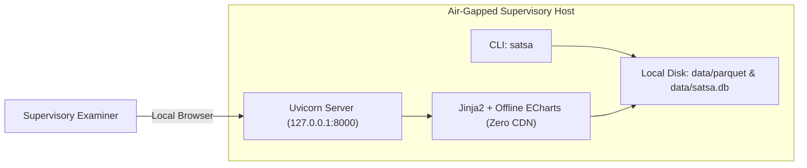

# SAT-SA Architecture & System Design

> **Supervisory Notice:** *Indicators requiring supervisory review; not a compliance determination.*

The **Supervisory Analytics Tool for SOC Assessment (SAT-SA)** is an air-gapped, fully deterministic analytical engine designed for the **National Critical Information Infrastructure Protection Centre (NCIIPC)**. It continuously assesses the operational execution quality and surveillance coverage of Security Operations Centres (SOCs) across Critical Sector Entities (CSEs) without relying on artificial intelligence or black-box machine learning.

---

## 1. Non-Negotiable Core Principles & "No AI/ML" Statement

SAT-SA adheres strictly to statutory explainability and regulatory integrity:
1. **Explicit "No AI/ML" Architecture:** Zero neural networks, zero LLMs, zero non-deterministic heuristics. Every finding is derived from relational algebra (SQL in DuckDB), deterministic rule predicates, and classical robust statistics (Median, Median Absolute Deviation [MAD], IQR, CUSUM, EWMA, Jaccard similarity).
2. **Strict Air-Gap & Data Minimization:** Operates entirely offline with 127.0.0.1 default binding. Outbound network sockets are blocked at runtime. Ingested actor names are pseudonymised via HMAC-SHA256 (`.satsa_salt`), and internal IPs/PII are redacted using deterministic regex masking.
3. **Cryptographic Tamper-Evidence:** All ingestion manifests, assessment runs, configuration changes, and examiner actions are recorded in an append-only SQLite log with `prev_hash` hash chaining (SHA3-256 for new entries). The chain detects edits, insertions, deletions and reordering within the chain; truncation of the newest entries is detected by comparing against an off-box `satsa audit head` checkpoint (DECISIONS.md ADR-005).

---

## 2. End-to-End Component Architecture

```mermaid
flowchart TD
    subgraph Data Sources [10 Critical Sector Entities]
        S1[Splunk SIEM CSV/JSON]
        S2[ServiceNow ITSM Logs]
        S3[TheHive Case Management]
    end

    subgraph Ingestion & Hygiene Engine
        AD[Source Adapters] --> NORM[Taxonomy Normaliser]
        NORM --> PSEUDO[HMAC-SHA256 Pseudonymiser]
        PSEUDO --> REDACT[Regex PII Redactor & Shingler]
        REDACT --> DQ[Data Quality Validator]
    end

    subgraph Dual Storage Layer
        DQ -->|Partitioned Columns| DUCK[(DuckDB / Parquet Store)]
        DQ -->|Audit Events & Manifests| SQLITE[(SQLite Cryptographic Audit DB)]
    end

    subgraph Analytical Core
        DUCK --> METRICS[DuckDB SQL Aggregation Engine]
        METRICS --> ROBUST[Robust Stats & SPC CUSUM/EWMA]
        ROBUST --> RULES[Deterministic Rules Engine EG01-12 & NS01-08]
        RULES --> SCORER[Noisy-OR Probabilistic Scorer]
        SCORER --> QUEUE[Prioritised Review Queue 70% Top / 30% Random]
    end

    subgraph Presentation & Governance
        QUEUE --> CARDS[Explainable Finding Cards]
        CARDS --> SQLITE
        SQLITE --> FASTAPI[Air-Gapped FastAPI REST API]
        FASTAPI --> UI[Offline Server-Rendered UI + Vendored ECharts]
        FASTAPI --> REP[HTML, PDF & CSV Report Generator]
    end

    Data Sources --> AD
```

---

## 3. Data Flow & Dual Storage Design

1. **Ingestion & Privacy Pipeline:**
   - Raw telemetric batches are read by source adapters (`SplunkAdapter`, `ServiceNowAdapter`, `TheHiveAdapter`).
   - `TaxonomyNormaliser` maps source-specific field names and severity labels into canonical schemas (`Alert`, `Case`, `WorkflowEvent`, `Escalation`, `Closure`, `Asset`).
   - `HMAC-SHA256` pseudonymises human analyst handles using a local 32-byte secret salt.
   - Deterministic regular expressions redact IPv4, IPv6, email addresses, hostnames, and card-like numbers. Text closures are converted to 4-shingle hashes to detect repetitive templates without preserving sensitive prose.
   - Batches failing schema validation or timestamp monotonicity are flagged in `dq_issues`.

2. **Columnar Parquet Store (DuckDB):**
   - High-volume telemetric tables (`alert`, `workflow_event`, `log_source_daily`, `asset`) are stored on disk as partitioned Parquet files (`parquet/{table}/entity_id={entity}/data.parquet`).
   - DuckDB executes partition-pruned, vectorized analytical scans, achieving >10M rows/second aggregation without row-level Python loops.

3. **Cryptographic State Store (SQLite):**
   - Stores runs, audit entries, finding cards, domain scores, review queues, and examiner feedback.
   - Guarantees forensic immutability via `prev_hash` cryptographic chaining.

---

## 4. Analytical Methodology & Detection Rules

- **Execution Gaps (EG01–EG12):** Detects operational shortcuts, metric gaming, implausible closure velocity, SLA deadline hugging, repeat alerts without tuning, KPI reconciliation gaps, and skipped lifecycle steps.
- **Negative Space (NS01–NS08):** Detects operational silence and missing evidence: unmonitored critical assets, missing attack categories, nighttime/weekend volume collapses, ID sequence gaps, and ghost inventory.
- **Scoring & Prioritisation:**
  - **Rule Score:** Distance beyond dynamic peer threshold damped by sample size confidence: $\text{Score} = \text{strength} \times \text{weight} \times \min(1, n / n_{\min})$.
  - **Domain Score:** Probabilistic Noisy-OR combination across 8 capability domains: $S_d = 100 \times \left(1 - \prod (1 - s_i/100)\right)$.
  - **Entity Risk Index:** Weighted sum of 8 capability domain scores plus breadth penalty.
  - **Review Queue:** 70% highest-scoring alerts/cases + 30% stratified random controls.

---

## 5. Deployment & Security Topology



- **Zero CDN Guarantee:** 100% of frontend assets (Apache ECharts v5, pure CSS) are locally vendored inside `satsa/ui/static`.
- **Role-Based Access Control (RBAC):** Simple local tokens enforce `admin`, `supervisor`, and `examiner` boundaries.
- **Rule Pack Updates:** Distributed as signed `.tar.gz` archives with detached SHA-256 HMAC manifests, imported via `satsa rules import`.
